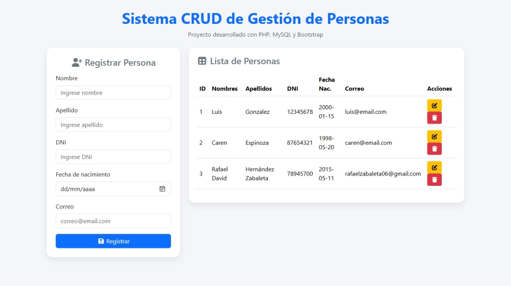
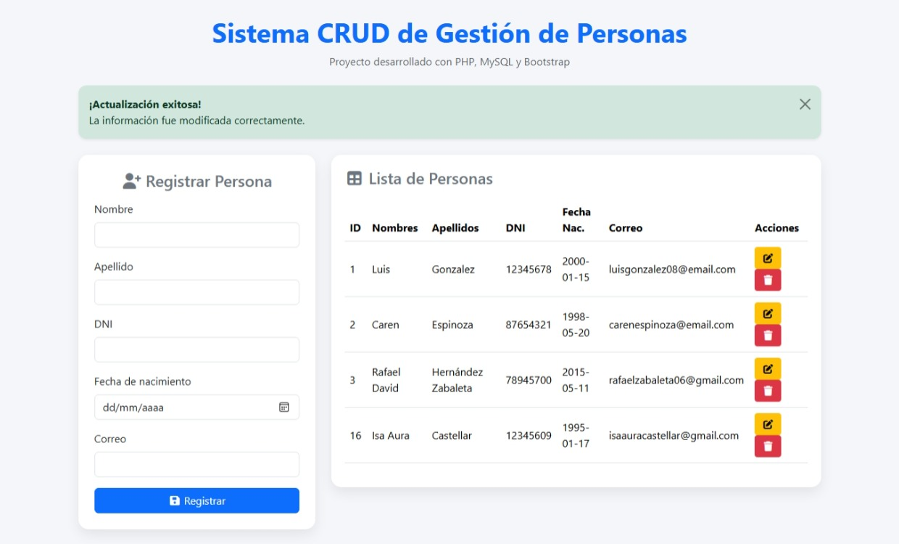
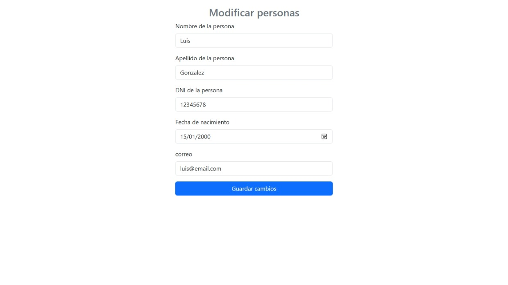
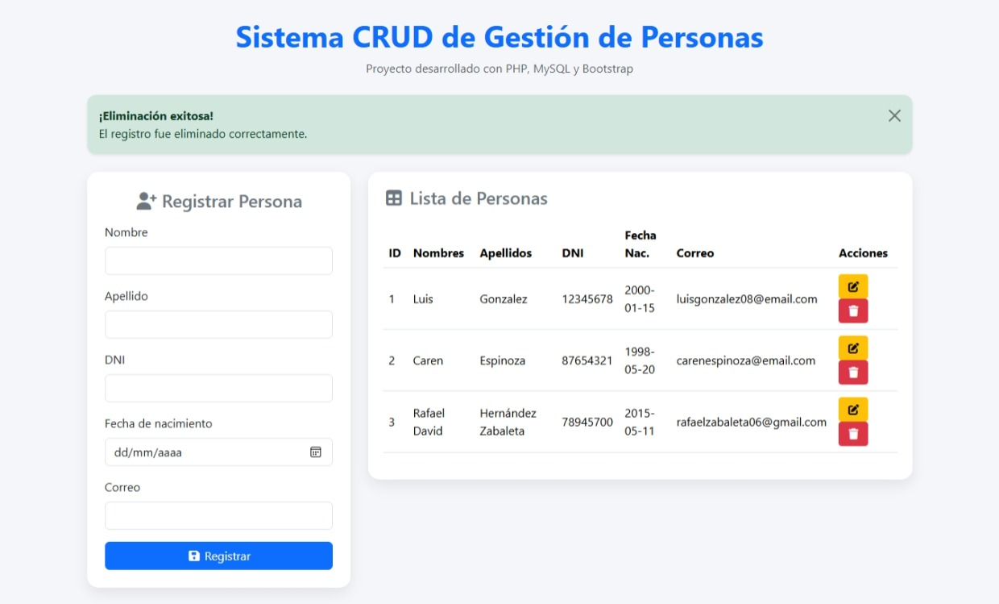

# Sistema de Gestión de Personas (PHP + MySQL)

Aplicación web desarrollada en PHP y MySQL para la gestión de personas mediante operaciones CRUD (Crear, Leer, Actualizar y Eliminar).
El sistema permite registrar, visualizar, editar y eliminar información de manera eficiente, con validaciones y retroalimentación visual para el usuario.

---

## Descripción

Este proyecto implementa un sistema básico de administración de datos enfocado en buenas prácticas iniciales de desarrollo web.
Incluye estructura organizada por carpetas, manejo de formularios, conexión a base de datos y uso de Bootstrap para mejorar la experiencia de usuario.

Está orientado a demostrar habilidades fundamentales en desarrollo backend con PHP y gestión de bases de datos relacionales.

---

## Funcionalidades

* Registro de personas con validación de campos
* Listado dinámico de registros desde base de datos
* Edición de información existente
* Eliminación de registros con confirmación
* Manejo de errores (campos vacíos y datos duplicados)
* Alertas visuales con Bootstrap para feedback del usuario
* Interfaz responsive y estructurada

---

## Tecnologías utilizadas

* PHP
* MySQL
* Bootstrap 5
* HTML5
* CSS3
* JavaScript
* XAMPP
* phpMyAdmin

---

## Estructura del proyecto

```
sistema-gestion-personas-php/
│
├── controlador/
│   ├── eliminar_persona.php
│   ├── modificar_persona.php
│   └── registro_persona.php
│
├── modelo/
│   └── conexion.php
│
├── img/
│   ├── inicio.png
│   ├── registro.png
│   ├── editar.png
│   ├── eliminar.png
│   ├── alerta de registro.png
│   └── alerta de eliminar.png
│
├── crud_php.sql
├── index.php
├── modificar_persona.php
└── README.md
```

---

## Capturas del sistema

### Vista principal



### Registro de persona



### Edición de datos



### Eliminación de registros



### Alertas del sistema


---

## Instalación y ejecución

1. Clonar el repositorio:

```
git clone https://github.com/Luisgonzalez0815/sistema-gestion-personas-php.git
```

2. Mover la carpeta al directorio de XAMPP:

```
C:\xampp\htdocs\
```

3. Importar la base de datos:

* Abrir phpMyAdmin
* Crear base de datos llamada: `crud_php`
* Importar archivo: `crud_php.sql`

4. Iniciar servicios en XAMPP:

* Apache
* MySQL

5. Ejecutar en navegador:

```
http://localhost/sistema-gestion-personas-php/
```

---

## Buenas prácticas aplicadas

* Separación por capas (controlador / modelo)
* Validación de formularios en backend
* Manejo de errores con mensajes claros
* Uso de Bootstrap para mejorar UX
* Código organizado y legible
* Uso de consultas SQL estructuradas

---

## Posibles mejoras futuras

* Sistema de autenticación (login)
* Buscador de registros
* Paginación
* API REST
* Dashboard administrativo
* Validación en frontend (JavaScript)

---

## Autor

Luis Felipe Gonzalez Castellar
Ingeniero de Software
Colombia

---

## Estado del proyecto

Proyecto funcional y listo para demostración técnica en portafolio profesional.
